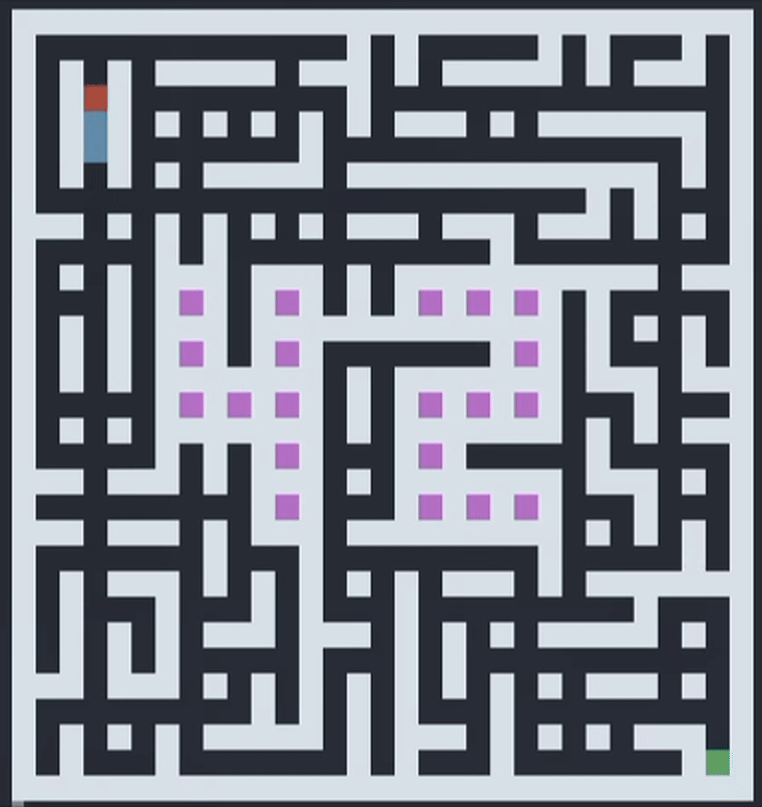

# A-Maze-ing

Python maze generator and solver with DFS/Prim generation, BFS shortest-path solving, config-driven output, and interactive ASCII visualization.



This project was created as part of the 42 curriculum by `nstreet-` and `pedde-al`.

## Features

- Generate valid mazes from a simple config file
- Solve the shortest path from entry to exit with BFS
- Choose between DFS and randomized Prim generation
- Support perfect and non-perfect mazes with configurable cycle density
- Export the maze to a text file
- Explore the result in an interactive ASCII viewer with path animation and color themes
- Reuse the generator as a Python package through `maze.MazeGenerator`

## Quick Start

### Prerequisites

- Python 3.10+
- `make`

### Installation

```bash
python3 -m venv .venv
source .venv/bin/activate
make install
```

### Run

```bash
make run
# or with a custom config path
make run CONFIG=path/to/config.txt
```

### Lint

```bash
make lint
make lint-strict
```

### Build the package

```bash
make package
```

## Example Config

Expected format: one `KEY=VALUE` pair per line, with optional `#` comments.

Mandatory keys:

- `WIDTH=<int>`
- `HEIGHT=<int>`
- `ENTRY=x,y`
- `EXIT=x,y`
- `OUTPUT_FILE=<name>.txt`
- `PERFECT=True|False`
- `SEED=<int>`

Optional keys:

- `ALGORITHM=DFS|PRIM`
- `CYCLE_DENSITY=<float>` in `[0.0, 0.3]` when `PERFECT=False`

```txt
WIDTH=30
HEIGHT=20
ENTRY=0,0
EXIT=29,19
OUTPUT_FILE=output.txt
PERFECT=False
SEED=42
ALGORITHM=PRIM
CYCLE_DENSITY=0.15
```

## How It Works

- `maze/generator.py` contains the main `MazeGenerator` class
- `maze/algorithms/` includes DFS and randomized Prim implementations
- `maze/solver.py` computes the shortest path with BFS
- `maze/pattern42.py` applies the optional centered `42` blocked pattern
- `render/ascii.py` provides the interactive terminal visualization
- `a_maze_ing.py` is the CLI entrypoint

## Reusable API

```python
from maze import MazeGenerator

gen = MazeGenerator(
    width=30,
    height=20,
    entry=(0, 0),
    exit=(29, 19),
    seed=42,
    algorithm="DFS",
)

gen.generate()

grid = gen.get_grid()
solution = gen.get_solution()
```

## Notes

- The package distribution name is `mazegen-amazeing`
- The internal grid uses cell wall bitmasks and does not need to match the text export format
- `MazeGenerator(config_dict)` is still supported for legacy compatibility

## Suggested GitHub Topics

`python`, `maze`, `maze-generator`, `maze-solver`, `pathfinding`, `dfs`, `prim-algorithm`, `bfs`, `ascii`, `cli`

## Demo Asset

The repository includes a real terminal demo GIF at `assets/demo.gif`.
